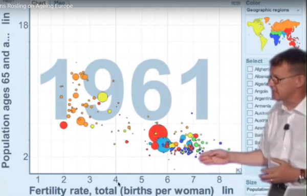

## YOUR NAME HERE


Package load:
```{r setup}

library(tidyverse)
library(readxl)

```


## Introduction

> For this homework assignment, please write your answer for each question after the question text but before the line break before the next one.

> In some cases, you will have to insert R code chunks, and run them to ensure that you've got the right result.

> Use all of the R Markdown formatting you want! Bullets, bold text, etc. is welcome.

> Once you have finished your assignment, create an HTML document by "knitting" the document using either the "Preview" or "Knit" button in the top left of the script window frame


## Questions

In this assignment, you will recreate an approximation of the chart Hans Rosling shows in the video here:

* Presentation Zen, [Hans Rosling: the zen master of presenting data](https://www.presentationzen.com/presentationzen/2010/07/hans-rosling-tips-on-presenting-data.html), 2010-07-11

This image captures the 1961 version of the plot:



### Data files

There are four files (sourced directly from https://www.gapminder.org/data/) that you will need:

There are CSV files for the following:

* Population, total: "population_total.csv"

* Population, aged 60+: "population_aged_60plus_years_total_number.csv"

* Babies per woman (total fertility): "children_per_woman_total_fertility.csv"

In addition, there is an Excel file that you'll need to use, which has the region that each country is in. 

* "Data Geographies - v1 - by Gapminder.xlsx", sheet = "list-of-countries-etc"


