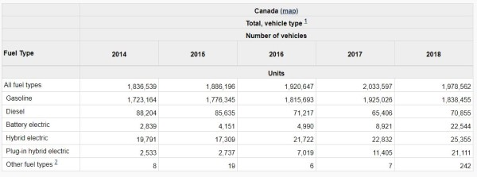

## Introduction

For this project, you will analyze trends in motor vehicle sales in Canada, by fuel type of the vehicle.

Statistics Canada publishes these data; they reported the release with some analysis here:
[New motor vehicle registrations, 2011 to 2018](https://www150.statcan.gc.ca/n1/daily-quotidien/191118/dq191118c-eng.htm)

Part of your project will create two tables: one is the Canadian totals, and it will look something like this (the multi-layer header is possible in R, but don't worry if you can't get it perfectly):

The second table will be an identical table, but with British Columbia numbers.

The second part is to create a plot or plots that demonstrate an interesting aspect of the data. This could be change over time, comparisons by fuel type, or comparisons of the Canadian total to British Columbia--or some other element you find in the data.

### Data source

The data for this project are in the "data" folder.

The data were sourced from: 

[Statistics Canada.  Table  20-10-0021-01   New motor vehicle registrations](https://www150.statcan.gc.ca/t1/tbl1/en/tv.action?pid=2010002101)

New motor vehicle registrations
Frequency: Annual

Table: 20-10-0021-01

Geography: Canada, Province or territory

-30-