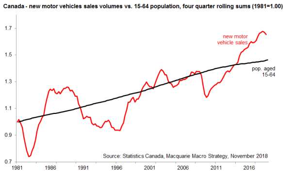

## Introduction

This project asks you to recreate the chart below, which was featured in the 2019 _Maclean's_ magazine "Chart Week" issue. 

[Auto sales point to a slowdown for the economy](https://www.macleans.ca/economy/economicanalysis/the-most-important-charts-to-watch-in-2019/)

Once you've created the chart for Canada, make a similar chart for British Columbia.

## Data

There are two files required to recreate this chart, both found in the "data" folder.

### Auto sales

[Statistics Canada.  Table  20-10-0001-01   New motor vehicle sales](https://www150.statcan.gc.ca/t1/tbl1/en/tv.action?pid=2010000101)

New motor vehicle sales 
Frequency: Monthly

Table: 20-10-0001-01 (formerly CANSIM 079-0003)

Geography: Canada, Province or territory

### Population

[Statistics Canada.  Table  17-10-0009-01   Population estimates, quarterly](https://www150.statcan.gc.ca/t1/tbl1/en/tv.action?pid=1710000901)

Population estimates, quarterly1 2 3 4
Frequency: Quarterly

Table: 17-10-0009-01 (formerly CANSIM 051-0005)

Geography: Canada, Province or territory

-30-