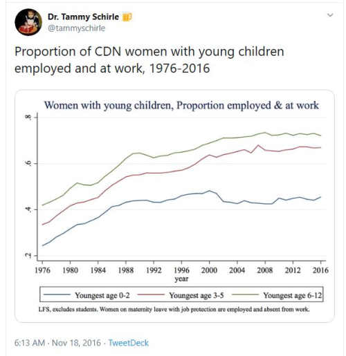

## Labour force participation of women with children

### Background

On 2016-11-18, [Dr. Tammy Schirle](https://legacy.wlu.ca/homepage.php?grp_id=1805&f_id=31) posted [a series of tweets](https://twitter.com/tammyschirle/status/799616596750831616) via her twitter account (@tammyschirle), showing the proportion of Canadian women with young children, employed and at work, from 1976-2015.

For this project, you will recreate this chart (note that the variables are slightly different than what's shown). Then, once you have completed the Canada version, make a second version using British Columbia data.

### Data source

Source: Statistics Canada, Labour Force Survey, Labour force characteristics by family age composition, annual

Table: 14-10-0120-01 (formerly CANSIM 282-0211)

DOI:   https://doi.org/10.25318/1410012001-eng

[Statistics Canada Open License Agreement](http://www.statcan.gc.ca/eng/reference/licence)

#### references

Kourtney Kobel and Tammy Schirle, ["The differential impact of universal child benefits on the labor supply of married and single mothers"](http://www.lcerpa.org/public/papers/LCERPA_2015_11.pdf)

Tyler Cowen, 2016, ["Why is female labor force participation down?"](http://marginalrevolution.com/marginalrevolution/2016/11/female-labor-force-participation.html) - U.S. measures

-30-