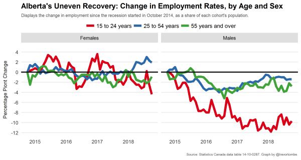

## Introduction

This project asks you to recreate the chart below, which was featured in the 2019 _Maclean's_ magazine "Chart Week" issue. 

[Alberta's uneven economic recovery](https://www.macleans.ca/economy/economicanalysis/the-most-important-charts-to-watch-in-2019/)

### Data source

Data file: "data_14100287_trunc.csv"

**NOTE:** 

The data available for this project is a truncated of the source file listed below. A number of variables have been removed, and any non-estimate values have been filtered out. See the file data_truncate.Rmd for details.

[Labour force characteristics, monthly, seasonally adjusted and trend-cycle, last 5 months](https://www150.statcan.gc.ca/t1/tbl1/en/tv.action?pid=1410028701)

Frequency: Monthly

Table: 14-10-0287-01 (formerly CANSIM 282-0087)

Geography: Canada, Province or territory

[Statistics Canada Open License Agreement](http://www.statcan.gc.ca/eng/reference/licence)

