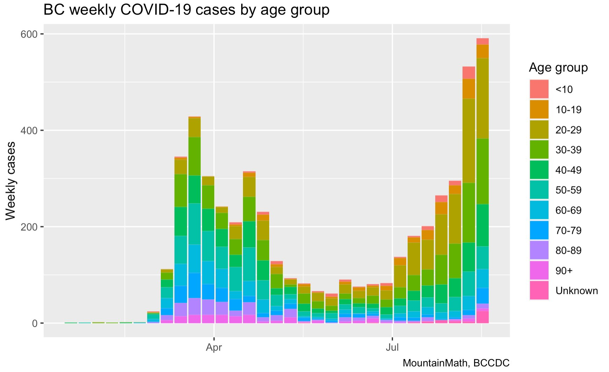
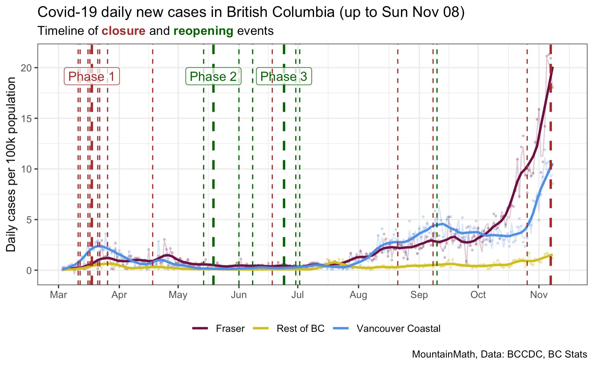

## Background

As the COVID-19 pandemic enters its next phase, the number of cases in British Columbia is increasing.

Here are two charts by Jens von Bergmann:

### BC weekly cases

https://twitter.com/vb_jens/status/1298407214189690880?s=20

### BC daily cases, adjusted for population

https://twitter.com/vb_jens/status/1325965304925577218?s=20

## Other visualizations of data from the same source

https://twitter.com/vb_jens/status/1323423179390418944?s=20

Animations:

https://twitter.com/vb_jens/status/1323649252770291713?s=20

## Data source

Source: COVID-19 Canada Open Data Working Group

[opencovid.ca GitHub repository](https://github.com/jeanpaulrsoucy/covid-19-canada-gov-data)

-30-