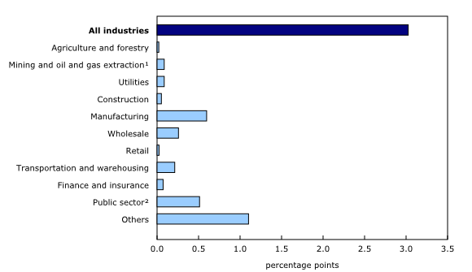
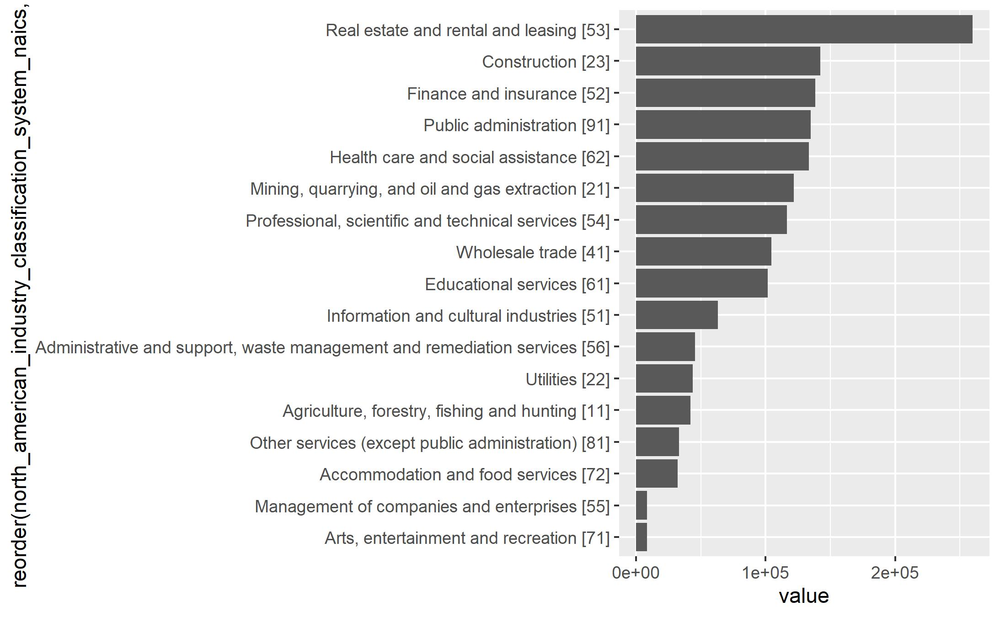

Gross Domestic Product by Industry
================

## Background

Every month, Statistics Canada publishes a detailed table showing the
Gross Domestic Product (GDP) created by the Canadian economy, broken
down by industry. The industry categories use the North American
Industry Classification System (NAICS), and starts in January 1997.

### The Daily

*The Daily* is Statistics Canada’s news release, which often includes an
analysis of the data. Here are two recent releases:

  - Gross domestic product by industry, August 2020: [The
    Daily, 2020-10-30](https://www150.statcan.gc.ca/n1/daily-quotidien/201030/dq201030a-eng.htm)

  - Gross domestic product by industry, July 2020: [The
    Daily, 2020-09-30](https://www150.statcan.gc.ca/n1/daily-quotidien/200930/dq200930a-eng.htm)
    
      - Table 1: Monthly gross domestic product by industry at basic
        prices in chained (2012) dollars – Seasonally adjusted
        <https://www150.statcan.gc.ca/n1/daily-quotidien/200930/t001a-eng.htm>
    
      - Chart 3: Main industrial sectors’ contribution to the percentage
        change in gross domestic product
        <https://www150.statcan.gc.ca/n1/daily-quotidien/200930/cg-a003-eng.htm>
        

### Other reference material

**NAICS reference documentation**
<https://www.statcan.gc.ca/eng/subjects/standard/naics/2017/v3/index>

**User guide** <https://www150.statcan.gc.ca/n1/en/catalogue/13-606-G>

**Detailed information**
<https://www23.statcan.gc.ca/imdb/p2SV.pl?Function=getSurvey&SDDS=1301>

### Data source

Source: Statistics Canada

Gross domestic product (GDP) at basic prices, by industry, monthly (x
1,000,000)1, 2 Frequency: Monthly

Table: 36-10-0434-01 (formerly CANSIM 379-0031)

Geography: Canada

[Statistics Canada Open License Agreement](http://www.statcan.gc.ca/eng/reference/licence)

## The Project

For this capstone project, you will use the {cansim} package to directly
access the GDP data table published by Statistics Canada.

  - CRAN page: [cansim: Accessing Statistics Canada Data Table and
    Vectors](https://cran.r-project.org/web/packages/cansim/index.html)

  - [{cansim} reference
    site](https://mountainmath.github.io/cansim/index.html)

A rough draft example plot, showing GDP in the latest month by 2-digit
NAICS industry:

\-30-
