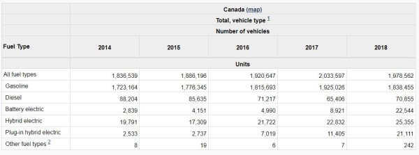
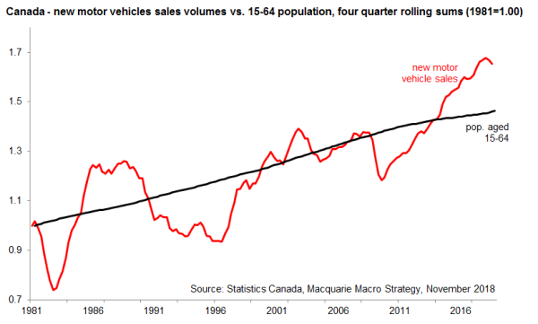
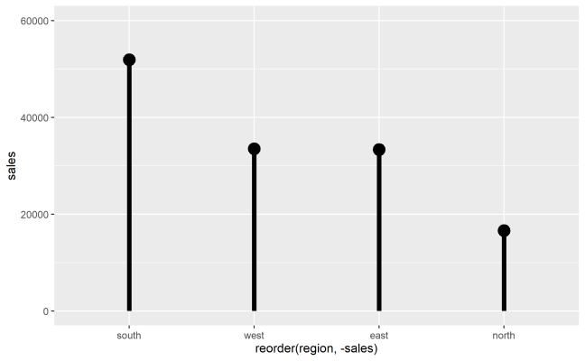

<!-- 
This file by Martin Monkman 
is licensed under a Creative Commons Attribution 4.0 International License
https://creativecommons.org/licenses/by/4.0/  
-->


```{r setup, include=FALSE}
options(htmltools.dir.version = FALSE)
```

```{r xaringan-themer, include=FALSE, warning=FALSE}
library(xaringanthemer)
style_duo_accent(
  primary_color = "#16161D",
  secondary_color = "#6e6e91",
  inverse_header_color = "#e2e2e9",
  header_font_google = google_font("Raleway"),
  text_font_google   = google_font("Raleway"),
  code_font_google   = google_font("Fira Mono")
)
```

## Project

(as described in the Course Outline)

A small project that will require the application of the concepts introduced:

* importing data

* data wrangling

* data modeling and summarization

* data visualization

* communication

---

## Capstone project description

The capstone project assignment is to create an R Markdown document that follows the steps in the "data science process" as shown in _R for Data Science_ by Hadley Wickham and Garrett Grolemund


---

To do this, you will have the end already defined: a summary table and/or a plot of some data that has been published.

The assignment is to replicate that summary table and plot

* starting with loading the data into your R environment ("import"),

* doing any necessary data tidying, transformations, and modeling, 

* followed by tabular and/or plotting visualizations

---

## Evaluation

The capstone project has a total of 40 marks and will be evaluated on the following marking scheme:

| MARKS | OUTCOME |
|-------|---------|
| 5 | data import, including defining the variable types |
| 10 | tidying and manipulation |
| 10 | visualization—tables and plots |
| 5 | going beyond—this might include adding an additional table, plot, or statistical model, or using functions so that your code isn't as WET |
| 10 | documentation throughout, explaining what the following R code is doing |


---

## Project options

### 1. The List

Select a project from the defined list. In these cases, data as downloaded from the source website will be provided. As well, the assignment documentation will include graphic images of specific charts and summary tables from the original source; the assignment will include the creation of charts and summary tables from the original data.

### 2. Define your own

This puts some onus on you—I will help you track down data and define the scope of a "minimally viable project" (to ensure you meet the assignment requirements or don't bite off more than is possible!)
 
 
---

## 1. Gapminder: 200 Countries, 200 Years

In this project, you will recreate three single year versions of the chart Hans Rosling shows in the video here:

* Gapminder, [200 Countries, 200 Years, 4 Minutes](https://www.gapminder.org/videos/200-years-that-changed-the-world-bbc/)


---

## 2. Gapminder: Aging Europe

You will recreate an approximation of the opening and closing charts Hans Rosling shows in the video here:

Presentation Zen, [Hans Rosling: the zen master of presenting data](https://www.presentationzen.com/presentationzen/2010/07/hans-rosling-tips-on-presenting-data.html), 2010-07-11


---

## 3. New motor vehicle sales in Canada by fuel type

For this project, you will create a summary table as was shown here, along with a graph. You may also want to explore provincial sales.



The Statistics Canada The Daily can be found here: [New motor vehicle registrations, 2011 to 2018](https://www150.statcan.gc.ca/n1/daily-quotidien/191118/dq191118c-eng.htm)


---

## 4. Auto sales as function of demographics

[Auto sales point to a slowdown for the economy](https://www.macleans.ca/economy/economicanalysis/the-most-important-charts-to-watch-in-2019/)




---

## 5. Women with children in the workforce


On 2016-11-18, [Dr. Tammy Schirle](https://legacy.wlu.ca/homepage.php?grp_id=1805&f_id=31) posted [a series of tweets](https://twitter.com/tammyschirle/status/799616596750831616) via her twitter account (@tammyschirle), showing the proportion of Canadian women with young children, employed and at work, from 1976-2015


---

## 6. Alberta’s uneven recovery


[Alberta's uneven recovery](https://www.macleans.ca/economy/economicanalysis/the-most-important-charts-to-watch-in-2019/)


---


## 7. Poverty in Canada

[Finally, a poverty plan. But will it work?](https://www.macleans.ca/economy/economicanalysis/the-most-important-charts-to-watch-in-2019/)


---

## 8. Classic Rock album sales 

Fictional business data for a wholesale company that sells nothing but the 25 biggest selling / most famous albums by the 25 most-played artists on "Classic Rock" radio stations. There are opportunities to create summary tables and plots by region, month and quarter, format, as well as by artist.



---

## 9. COVID-19 regional case counts 

Using data released by the British Columbia Public Health Office and Centre for Disease Control, showing the number of COVID-19 cases in British Columbia by health region and age.

(details to follow)


